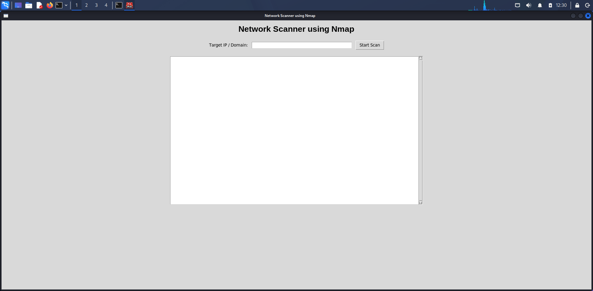
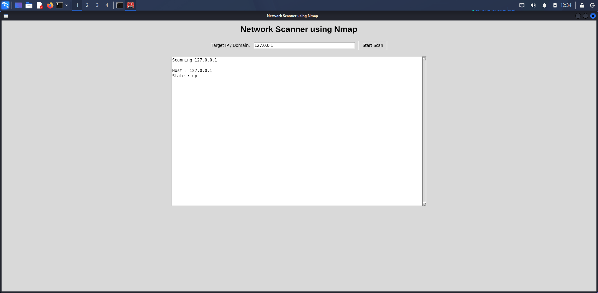
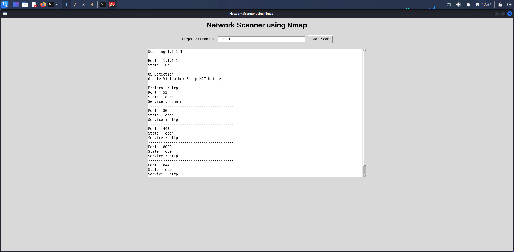
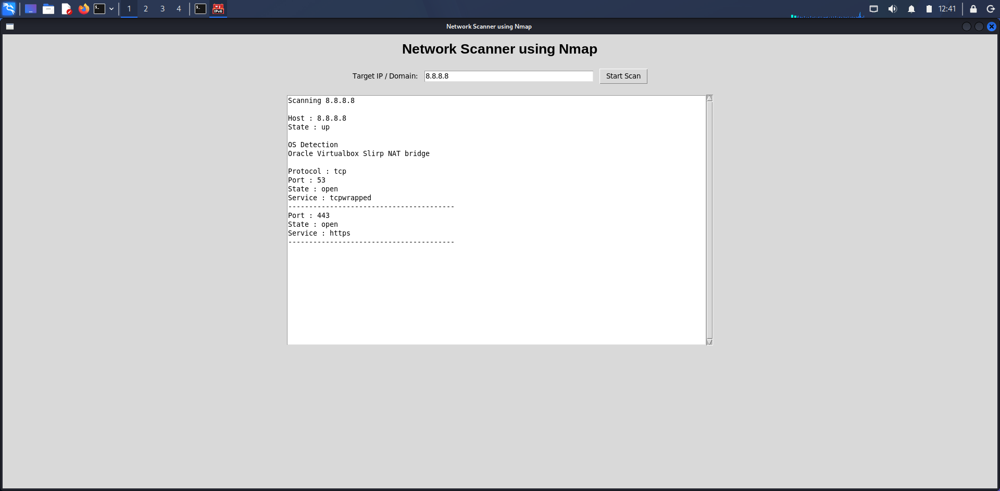

# Network Scanner using Nmap

# Overview

A Python-based GUI Network Scanner built using Python, Tkinter, and Nmap. This tool performs host discovery, OS fingerprinting, service detection, and port scanning for local and remote targets. Multi-threading is used to keep the GUI responsive during scans.

# Features

- Host Discovery
- Port Scanning
- Service Detection
- OS Fingerprinting
- GUI built with Tkinter
- Multi-threaded Scanning

# Technologies Used

- Python
- Python-Nmap
- Nmap
- Tkinter
- Kali Linux

# Targets Tested

- Localhost (127.0.0.1)
- Google DNS (8.8.8.8)
- Cloudflare DNS (1.1.1.1)
- scanme.nmap.org (Official Nmap Test Server)
- Authorized Remote Host (Permission obtained)

# Sample Results

Google DNS (8.8.8.8)

- Host Status: Up
- Open Ports: 53, 443

Cloudflare DNS (1.1.1.1)

- Host Status: Up
- Open Ports: 53, 80, 443, 8080

# Skills Demonstrated

- Network Reconnaissance
- Host Discovery
- Port Scanning
- Service Enumeration
- OS Detection
- Python GUI Development
- Multi-threading

# Disclaimer

This project is intended for educational purposes only. Scan only systems that you own or have explicit permission to test.
## Screenshots

### GUI Home

### Local Host Scan

### Cloudflare DNS Scan

### Google DNS Scan

